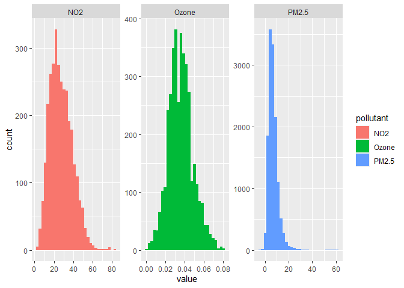
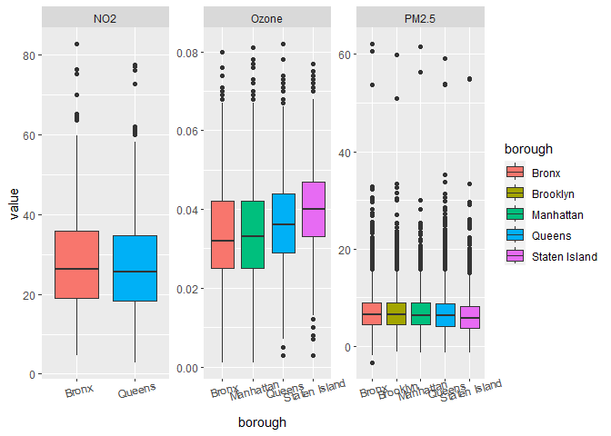
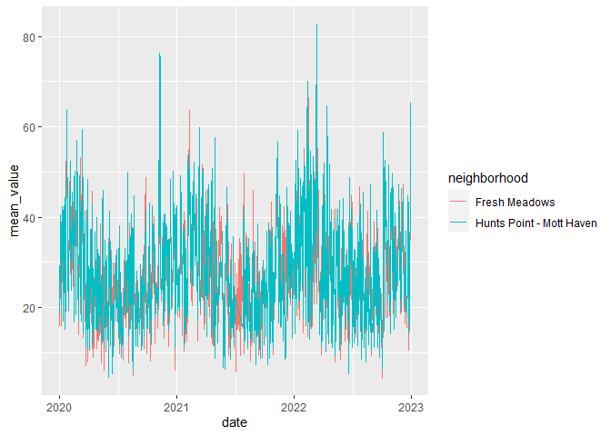
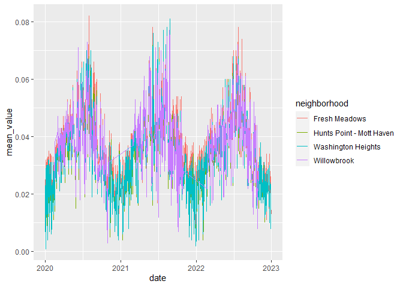
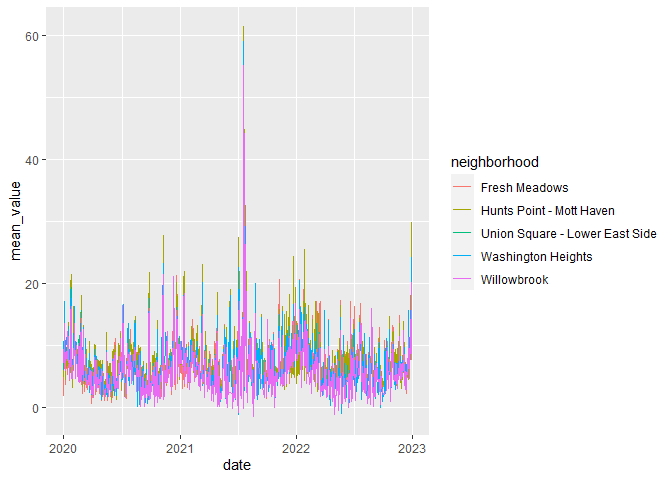

EDA on Daily Air Quality Data
================
Gustavo Garcia-Franceschini
2023-12-06

# Data files

``` r
daily_air = read_csv(here::here("data/cleaned_data/alt_air_data.csv")) %>%
  mutate(borough = case_when(
    county == "New York" ~ "Manhattan",
    county == "Bronx" ~ "Bronx",
    county == "Kings" ~ "Brooklyn",
    county == "Queens" ~ "Queens",
    county == "Richmond" ~ "Staten Island"
  )) %>% 
  filter(pollutant != "CO")
```

    ## Rows: 23685 Columns: 26
    ## ── Column specification ────────────────────────────────────────────────────────
    ## Delimiter: ","
    ## chr (11): date, source, units, site_name, aqs_parameter_desc, cbsa_name, sta...
    ## dbl (15): site_id, poc, daily_aqi_value, daily_obs_count, percent_complete, ...
    ## 
    ## ℹ Use `spec()` to retrieve the full column specification for this data.
    ## ℹ Specify the column types or set `show_col_types = FALSE` to quiet this message.

# Distributions of pollutant measurements

``` r
daily_air %>%
  ggplot() + geom_histogram(aes(x = value, fill = pollutant)) + 
  facet_wrap(~pollutant, scales = 'free')
```

    ## `stat_bin()` using `bins = 30`. Pick better value with `binwidth`.

<!-- -->

# Distributions of pollutant measurements by county

``` r
daily_air %>%
  ggplot() + geom_boxplot(aes(x = borough, y = value, fill = borough)) + 
  theme(axis.text.x  = element_text(angle=15)) +
  facet_wrap(~pollutant, scales = 'free')
```

<!-- -->

# Observing Washington Heights and Union Square

``` r
#this data maps measurement sites to neighborhoods

sites_nghbors = read_csv(here::here("data/cleaned_data/pollutant_per_neighborhood.csv"))
```

    ## Rows: 25 Columns: 5
    ## ── Column specification ────────────────────────────────────────────────────────
    ## Delimiter: ","
    ## chr (4): site_name, pollutant, geo_place_name, geometry
    ## dbl (1): zip_code
    ## 
    ## ℹ Use `spec()` to retrieve the full column specification for this data.
    ## ℹ Specify the column types or set `show_col_types = FALSE` to quiet this message.

``` r
wash_heights = sites_nghbors %>%
  filter(geo_place_name == "Washington Heights") %>%
  pull(zip_code)

daily_aq_wh = daily_air %>%
  filter(zip_code %in% wash_heights) %>%
  group_by(date, pollutant) %>%
  summarize(mean_value = mean(value))
```

    ## `summarise()` has grouped output by 'date'. You can override using the
    ## `.groups` argument.

``` r
#Where Fresh Meadows is Queens and Willowbrook is in Staten Island
#Hunts Point - Mott Haven is in Bronx

#my neighborhoods on interest:

neighborhoods = c("Washington Heights", "Union Square - Lower East Side",
                  "Willowbrook", "Hunts Point - Mott Haven", "Fresh Meadows")

store_data = vector("list", length = 5)

for (i in 1:length(neighborhoods)) {
  
  n = neighborhoods[i]
  
  n_zips = sites_nghbors %>%
  filter(geo_place_name == n) %>%
  pull(zip_code)
  
  daily_data = daily_air %>%
    filter(zip_code %in% n_zips) %>%
    group_by(date, pollutant) %>%
    summarize(mean_value = mean(value)) %>%
    mutate(neighborhood = n)
  
  store_data[[i]] = daily_data
  
}
```

    ## `summarise()` has grouped output by 'date'. You can override using the
    ## `.groups` argument.
    ## `summarise()` has grouped output by 'date'. You can override using the
    ## `.groups` argument.
    ## `summarise()` has grouped output by 'date'. You can override using the
    ## `.groups` argument.
    ## `summarise()` has grouped output by 'date'. You can override using the
    ## `.groups` argument.
    ## `summarise()` has grouped output by 'date'. You can override using the
    ## `.groups` argument.

``` r
daily_neighborhood_data = bind_rows(store_data[[1]], store_data[[2]]) %>%
  bind_rows(store_data[[3]]) %>%
  bind_rows(store_data[[4]]) %>%
  bind_rows(store_data[[5]]) %>%
  mutate(date = as.Date(date, format = "%m/%d/%Y"))
```

# Some time series stuff

``` r
daily_neighborhood_data %>%
  filter(pollutant == "NO2") %>%
  ggplot() + geom_line(aes(x = date, y = mean_value,
                            group = neighborhood, color = neighborhood))
```

<!-- -->

``` r
daily_neighborhood_data %>%
  filter(pollutant == "Ozone") %>%
  ggplot() + geom_line(aes(x = date, y = mean_value,
                            group = neighborhood, color = neighborhood))
```

<!-- -->

``` r
daily_neighborhood_data %>%
  filter(pollutant == "PM2.5") %>%
  ggplot() + geom_line(aes(x = date, y = mean_value,
                            group = neighborhood, color = neighborhood))
```

<!-- -->
